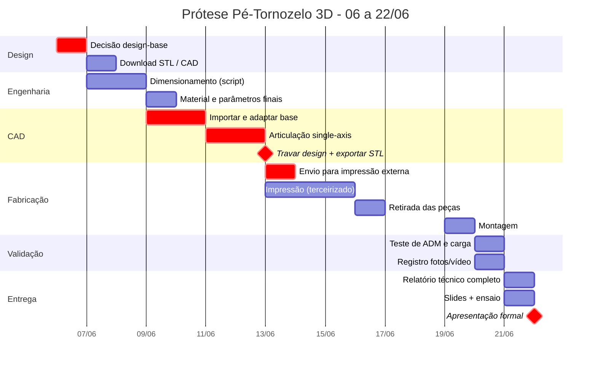

# Roadmap - Prótese Funcional Pé-Tornozelo 3D
**Dispositivos de Reabilitação - FUMEC - Entrega: 22/06/2026**

> Produto físico + Relatório técnico + Apresentação formal
> Caminho crítico: **Decisão de design -> CAD -> Envio para impressão externa**
> ⚠ Impressão terceirizada: STLs saem até **13/06** - prazo antecipado em 1 dia vs. plano original.

---

## Cronograma geral



---

## Árvore de tarefas por fase

```
╔══════════════════════════════════════════════════════════════════╗
║  FASE 1 · DECISÃO DE DESIGN                          06/06       ║
╚══════════════════════════════════════════════════════════════════╝
  │
  ├─ [ ] Leitura da matriz de decisão (refs/decisao_design_base.md)
  ├─ [ ] ◆ Seleção do design-base e registro no README.md
  │         └─ recomendação: Make3D Printables #293133 (score 4,2/5)
  └─ [ ] Download dos arquivos STL + STEP/F3D -> cad/ e refs/

╔══════════════════════════════════════════════════════════════════╗
║  FASE 2 · ENGENHARIA                                 07-09/06    ║
╚══════════════════════════════════════════════════════════════════╝
  │  Corre em paralelo ao início do CAD
  │
  ├─ [ ] Medição de B, H, L do keel no STL (Fusion / Blender)
  ├─ [ ] Execução de testes/dimensionamento.py com dimensões reais
  │         ├─ tensão na seção crítica (carga 1030 N, FS 2,5)
  │         ├─ comparação PETG × PLA-CF
  │         └─ espessura de parede e infill mínimos
  └─ [ ] ◆ Confirmação de material: PETG (keel) · TPU 95A (batentes) · M8 aço (eixo)

╔══════════════════════════════════════════════════════════════════╗
║  FASE 3 · CAD                                        09-13/06    ║
╚══════════════════════════════════════════════════════════════════╝
  │  ⚠ Gargalo criativo - prazo real é 13/06 (envio externo)
  │
  ├─ [ ] Importar STEP do design-base (FreeCAD / Fusion 360)
  ├─ [ ] Adaptação do keel (espessura + geometria pelos resultados do script)
  ├─ [ ] Articulação single-axis (dorsi/plantarflexão)
  │         ├─ furo para eixo M8 (tolerância H7/h6)
  │         ├─ batente dorsal TPU (10-15°)
  │         └─ batente plantar TPU (15-20°)
  ├─ [ ] Adaptação do conector de pylon
  ├─ [ ] ⚡ MINI-IMPRESSÃO LOCAL: protótipo da junta isolada
  │         └─ valida folga + ADM antes de enviar tudo
  ├─ [ ] Ajuste de tolerâncias pós mini-impressão
  ├─ [ ] ◆ TRAVAR DESIGN - 13/06 (não alterar depois)
  └─ [ ] Exportar STLs por peça nomeados + slicing/ESPECIFICACOES_IMPRESSAO.md

╔══════════════════════════════════════════════════════════════════╗
║  FASE 4 · ENVIO PARA IMPRESSÃO EXTERNA               13/06       ║
╚══════════════════════════════════════════════════════════════════╝
  │  ⚠ Sem slicer necessário - entregar STL + especificações
  │
  ├─ [ ] Conferir todos os STLs (um por peça, sem erros de malha)
  ├─ [ ] Enviar STLs + slicing/ESPECIFICACOES_IMPRESSAO.md
  ├─ [ ] Confirmar prazo de entrega e retirada
  └─ [ ] Reservar opção de impressora local para emergência

╔══════════════════════════════════════════════════════════════════╗
║  FASE 5 · RETIRADA + INSPEÇÃO                        16-17/06    ║
╚══════════════════════════════════════════════════════════════════╝
  │
  ├─ [ ] Inspeção visual + dimensional de cada peça
  ├─ [ ] Registro fotográfico das peças -> fotos/
  └─ [ ] Solicitar reimpressão se necessário (buffer até 18/06)

╔══════════════════════════════════════════════════════════════════╗
║  FASE 6 · MONTAGEM                                   19/06       ║
╚══════════════════════════════════════════════════════════════════╝
  │
  ├─ [ ] Montagem da articulação (eixo M8 + porca + bucha + batentes)
  ├─ [ ] Encaixe keel + pylon + pé
  ├─ [ ] Verificação de movimento livre e batentes
  └─ [ ] Registro fotográfico da montagem -> fotos/

╔══════════════════════════════════════════════════════════════════╗
║  FASE 7 · VALIDAÇÃO                                  20/06       ║
╚══════════════════════════════════════════════════════════════════╝
  │
  ├─ [ ] Teste de ADM
  │         ├─ medir dorsiflexão real (alvo: 10-15°)
  │         └─ medir plantarflexão real (alvo: 15-20°)
  ├─ [ ] Teste de carga
  │         ├─ aplicar carga conhecida (estático)
  │         └─ observar e registrar deformação / ausência de falha
  ├─ [ ] Planilha de custo real -> testes/custo.csv
  └─ [ ] Registro em vídeo do ciclo de movimento -> fotos/

╔══════════════════════════════════════════════════════════════════╗
║  FASE 8 · RELATÓRIO + SLIDES                         21/06       ║
╚══════════════════════════════════════════════════════════════════╝
  │
  ├─ [ ] Relatório técnico (RELATORIO.md)
  │         ├─ seções 2, 3, 5 - já preenchidas pela Missão 1
  │         ├─ seção 4 - concepção/CAD (redigir pelo grupo)
  │         ├─ seções 6, 7, 8, 9 - análise dos dados de validação
  │         └─ abstract + referências ABNT
  ├─ [ ] Slides da apresentação
  │         ├─ problema + motivação
  │         ├─ biomecânica e requisitos
  │         ├─ design + decisões
  │         ├─ fabricação + parâmetros
  │         └─ validação + resultados + conclusão
  └─ [ ] Ensaio cronometrado da apresentação

╔══════════════════════════════════════════════════════════════════╗
║  MARCO FINAL · APRESENTAÇÃO FORMAL                   22/06       ║
╚══════════════════════════════════════════════════════════════════╝
  │
  ├─ Produto físico funcional em mãos
  ├─ Relatório técnico entregue
  └─ Defesa dos trade-offs de engenharia
```

---

## Dependências críticas

```
Decisão design-base (06/06)
       │
       ▼
  Download CAD ──────────────── Dimensionamento.py (paralelo)
       │                                │
       ▼                                ▼
  CAD completo ◄──────────── Material + parâmetros confirmados
       │
       ▼
  ◆ TRAVAR + EXPORTAR STLs (13/06) ◄─ prazo real antecipado
       │
       ▼
  Envio impressão externa ──► Retirada ──► Montagem ──► Validação
                                                │
                                      ┌─────────┴──────────┐
                                      ▼                    ▼
                                Relatório               Slides
                                      └─────────┬──────────┘
                                                ▼
                                        APRESENTAÇÃO 22/06
```

---

## Status atual

| Fase | Status | Observação |
|------|--------|------------|
| Fundação técnica (biomecânica, requisitos, dimensionamento) | ✅ Concluído | MINERVA - Missão 1 |
| Decisão design-base | ✅ Concluído | **A - Make3D #293133** (voto do grupo, 08/06) |
| Download CAD | ✅ Concluído | STLs em `cad/A_make3d_293133/`; dimensionamento re-rodado com geometria medida |
| CAD | ⏳ Pendente | Prazo real: 13/06. ⚠ pacote de A só tem STL (sem STEP/F3D) - remix por edição de malha |
| Envio impressão externa | ⏳ Pendente | Confirmar fornecedor |
| Montagem / Validação / Relatório / Slides | ⏳ Pendente | - |
