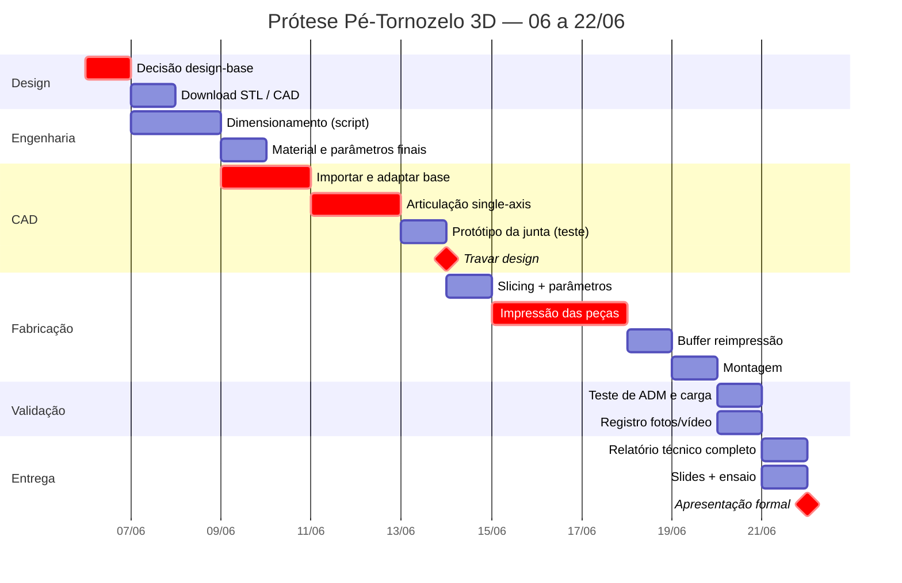

# Roadmap — Prótese Funcional Pé-Tornozelo 3D
**Dispositivos de Reabilitação · FUMEC · Entrega: 22/06/2026**

> Produto físico + Relatório técnico + Apresentação formal
> Caminho crítico: **Decisão de design → CAD → Impressão**

---

## Cronograma geral



---

## Árvore de tarefas por fase

```
╔══════════════════════════════════════════════════════════════════╗
║  FASE 1 · DECISÃO DE DESIGN                          06/06       ║
╚══════════════════════════════════════════════════════════════════╝
  │
  ├─ [ ] Leitura da matriz de decisão (refs/decisao_design_base.md)
  ├─ [ ] ◆ Seleção do design-base e registro no README.md
  │         └─ recomendação: Make3D Printables #293133 (score 4,2/5)
  └─ [ ] Download dos arquivos STL + STEP/F3D → cad/ e refs/

╔══════════════════════════════════════════════════════════════════╗
║  FASE 2 · ENGENHARIA                                 07–09/06    ║
╚══════════════════════════════════════════════════════════════════╝
  │  ↳ Corre em paralelo ao início do CAD
  │
  ├─ [ ] Medição de B, H, L do keel no STL (Fusion / PrusaSlicer)
  ├─ [ ] Execução de testes/dimensionamento.py com dimensões reais
  │         ├─ tensão na seção crítica (carga 1030 N, FS 2,5)
  │         ├─ comparação PETG × PLA-CF
  │         └─ espessura de parede e infill mínimos
  └─ [ ] ◆ Confirmação de material: PETG (keel) · TPU 95A (batentes) · M8 aço (eixo)

╔══════════════════════════════════════════════════════════════════╗
║  FASE 3 · CAD                                        09–14/06    ║
╚══════════════════════════════════════════════════════════════════╝
  │  ⚠ Gargalo criativo — sem IA substituta
  │
  ├─ [ ] Importar STEP do design-base (Fusion 360 / FreeCAD)
  ├─ [ ] Adaptação do keel (espessura + geometria pelos resultados do script)
  ├─ [ ] Articulação single-axis (dorsi/plantarflexão)
  │         ├─ furo para eixo M8 (tolerância H7/h6)
  │         ├─ batente dorsal TPU (10–15°)
  │         └─ batente plantar TPU (15–20°)
  ├─ [ ] Adaptação do conector de pylon
  ├─ [ ] ⚡ MINI-IMPRESSÃO: protótipo da junta isolada
  │         └─ valida folga + ADM antes de imprimir a peça inteira
  ├─ [ ] Ajuste de tolerâncias pós mini-impressão
  └─ [ ] ◆ TRAVAR DESIGN — 14/06 (não alterar depois)

╔══════════════════════════════════════════════════════════════════╗
║  FASE 4 · SLICING                                    14–15/06    ║
╚══════════════════════════════════════════════════════════════════╝
  │  ⚠ 15/06 = início do estágio (08–14h) — janela curta
  │
  ├─ [ ] Orientação de impressão: keel deitado (carga no plano XY)
  ├─ [ ] Parâmetros: infill ≥ 40% · paredes ≥ 3 · suportes mínimos
  ├─ [ ] Separação de perfis por material (PETG × TPU)
  ├─ [ ] Estimativa de tempo total + consumo de filamento
  └─ [ ] Salvar perfil e .3mf → slicing/

╔══════════════════════════════════════════════════════════════════╗
║  FASE 5 · IMPRESSÃO                                  15–18/06    ║
╚══════════════════════════════════════════════════════════════════╝
  │  ⚠ Maior risco de prazo — reservar buffer de reimpressão
  │
  ├─ [ ] Impressão das peças estruturais (PETG)
  ├─ [ ] Impressão dos batentes (TPU 95A)
  ├─ [ ] Inspeção visual + dimensional de cada peça
  ├─ [ ] Reimpressão de falhas (buffer até 18/06)
  └─ [ ] Registro fotográfico de cada peça → fotos/

╔══════════════════════════════════════════════════════════════════╗
║  FASE 6 · MONTAGEM                                   19/06       ║
╚══════════════════════════════════════════════════════════════════╝
  │
  ├─ [ ] Montagem da articulação (eixo M8 + porca + bucha + batentes)
  ├─ [ ] Encaixe keel + pylon + pé
  ├─ [ ] Verificação de movimento livre e batentes
  └─ [ ] Registro fotográfico da montagem → fotos/

╔══════════════════════════════════════════════════════════════════╗
║  FASE 7 · VALIDAÇÃO                                  20/06       ║
╚══════════════════════════════════════════════════════════════════╝
  │
  ├─ [ ] Teste de ADM
  │         ├─ medir dorsiflexão real (alvo: 10–15°)
  │         └─ medir plantarflexão real (alvo: 15–20°)
  ├─ [ ] Teste de carga
  │         ├─ aplicar carga conhecida (estático)
  │         └─ observar e registrar deformação / ausência de falha
  ├─ [ ] Planilha de custo real → testes/custo.csv
  └─ [ ] Registro em vídeo do ciclo de movimento → fotos/

╔══════════════════════════════════════════════════════════════════╗
║  FASE 8 · RELATÓRIO + SLIDES                         21/06       ║
╚══════════════════════════════════════════════════════════════════╝
  │
  ├─ [ ] Relatório técnico (RELATORIO.md)
  │         ├─ seções 2, 3, 5 — já preenchidas pela Missão 1
  │         ├─ seção 4 — concepção/CAD (redigir pelo grupo)
  │         ├─ seções 6, 7, 8, 9 — análise dos dados de validação
  │         └─ abstract + referências ABNT
  ├─ [ ] Slides da apresentação
  │         ├─ problema + motivação
  │         ├─ biomecânica e requisitos
  │         ├─ design + decisões
  │         ├─ fabricação + parâmetros
  │         └─ validação + resultados + conclusão
  └─ [ ] Ensaio cronometrado da apresentação

╔══════════════════════════════════════════════════════════════════╗
║  MARCO FINAL · APRESENTAÇÃO FORMAL                   22/06       ║
╚══════════════════════════════════════════════════════════════════╝
  │
  ├─ Produto físico funcional em mãos
  ├─ Relatório técnico entregue
  └─ Defesa dos trade-offs de engenharia
```

---

## Dependências críticas

```
Decisão design-base
       │
       ▼
  Download CAD ──────────────── Dimensionamento.py (paralelo)
       │                                │
       ▼                                ▼
  CAD completo ◄──────────── Material + parâmetros confirmados
       │
       ▼
  ◆ TRAVAR DESIGN (14/06)
       │
       ▼
  Slicing ──► Impressão ──► Montagem ──► Validação
                                              │
                                    ┌─────────┴──────────┐
                                    ▼                    ▼
                              Relatório               Slides
                                    └─────────┬──────────┘
                                              ▼
                                      APRESENTAÇÃO 22/06
```

---

## Status atual

| Fase | Status | Observação |
|------|--------|------------|
| Fundação técnica (biomecânica, requisitos, dimensionamento) | ✅ Concluído | MINERVA — Missão 1 |
| Decisão design-base | ⏳ Pendente | Matriz pronta — aguarda veredito |
| Download CAD | ⏳ Pendente | Depende da decisão acima |
| CAD | ⏳ Pendente | Caminho crítico |
| Impressão | ⏳ Pendente | Impressora disponível ✅ |
| Montagem / Validação / Relatório / Slides | ⏳ Pendente | — |
