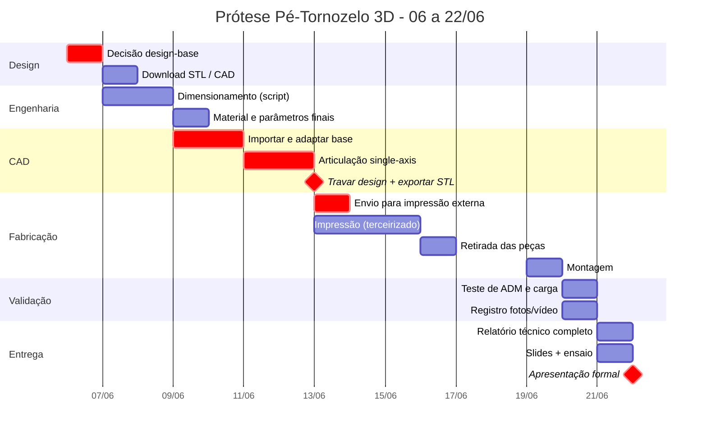

# Roadmap - Prótese Funcional Pé-Tornozelo 3D
**Dispositivos de Reabilitação - FUMEC - Entrega: 22/06/2026**

> Produto físico + Relatório técnico + Apresentação formal
> Caminho crítico: **Decisão de design -> CAD -> Envio para impressão externa**
> ⚠ Impressão terceirizada: STLs saem até **13/06** - prazo antecipado em 1 dia vs. plano original.

---

## Cronograma geral



---

## Árvore de tarefas por fase

```
╔══════════════════════════════════════════════════════════════════╗
║  FASE 1 · DECISÃO DE DESIGN                  ✅ CONCLUÍDA 08/06  ║
╚══════════════════════════════════════════════════════════════════╝
  │
  ├─ [x] Leitura da matriz de decisão (refs/decisao_design_base.md)
  ├─ [x] ◆ Seleção do design-base: A — Make3D #293133 (voto do grupo, 08/06)
  └─ [x] Download dos STLs -> cad/A_make3d_293133/ (sem STEP - só malha)

╔══════════════════════════════════════════════════════════════════╗
║  FASE 2 · ENGENHARIA                         ✅ CONCLUÍDA 09/06  ║
╚══════════════════════════════════════════════════════════════════╝
  │  (MINERVA Missão 1 + Missão 1.5)
  │
  ├─ [x] Medição de B, H, L do keel no STL (parse numpy direto)
  │         └─ seção crítica medida: B=43 H=37 L=55 mm (InnerFoot.stl)
  ├─ [x] Execução de testes/dimensionamento.py com dimensões reais
  │         ├─ PETG: t_parede ≥ 4,3 mm · FS 2,5 · σ_adm 9 MPa ✔
  │         ├─ PLA-CF descartado (t=10 mm, anisotropia Z agravada)
  │         └─ Elo fraco = furo no plástico (bearing) → bucha metálica obrigatória
  ├─ [x] ◆ Material confirmado: PETG (keel) · TPU 95A (batentes) · M8 8.8 (eixo)
  └─ [x] Levantamento da articulação (MINERVA 1.5 — cad/A_make3d_293133/MEDIDAS_ARTICULACAO.md)
           ├─ furo nativo do pino: Ø4,8 mm (≈M5) → re-furar Ø8,4 no CAD
           ├─ bore TopJoint: Ø10,0 mm → casa exatamente com bucha nylon 10×8 (OD10/ID8)
           ├─ batente RubberCube: envelope 22,85 × 19,04 × 28 mm → reproduzir em TPU 95A
           ├─ Insert (pylon): interface custom retangular, NÃO é pirâmide ISO 30 mm
           ├─ escala: pé nativo 210 mm → alvo 265 mm = fator ×1,262
           └─ sem STEP/F3D oficial — remix via edição de malha (Blender)

╔══════════════════════════════════════════════════════════════════╗
║  FASE 3 · CAD (BLENDER)                              09-13/06    ║
╚══════════════════════════════════════════════════════════════════╝
  │  ⚠ GARGALO — prazo real 13/06 (envio externo no mesmo dia)
  │  Ferramenta: Blender (edição de malha). Referência completa:
  │  cad/A_make3d_293133/MEDIDAS_ARTICULACAO.md
  │
  ├─ [ ] ⚠ ANTES de abrir o Blender — comprar ferragem (urgente):
  │         ├─ bucha nylon 10×8 (OD 10 / ID 8) — 2 un.
  │         ├─ parafuso M8 × 60 mm classe 8.8 — 1 un.
  │         └─ porca M8 + 2× arruela M8
  │
  ├─ [x] ◆ Decisão pylon: **Opção A — manter Insert custom do design-base** (grupo, 09/06)
  │         → conector simplificado integrado ao modelo; suficiente para demonstração acadêmica
  │
  ├─ [ ] Blender — importar os 5 STLs de cad/A_make3d_293133/:
  │         InnerFoot · TopJoint · FootRubber · RubberCube · Insert
  │
  ├─ [ ] Escalar o CASCO ×1,262 (não escalar a junta junto):
  │         ├─ selecionar: FootRubber + InnerFoot (+ Insert se mantiver custom)
  │         ├─ S → 1.262 → Enter (escala uniforme global)
  │         └─ NÃO incluir TopJoint na seleção — bore Ø10 nativo deve ser mantido
  │
  ├─ [ ] Re-furar InnerFoot (M5 nativo → M8):
  │         ├─ Add → Cylinder: Ø 8,4 mm, eixo Y, centro em X ≈ −6,2 (escale o X tbm)
  │         ├─ Boolean Difference: InnerFoot − cilindro
  │         └─ resultado: furo Ø8,4 coaxial ao bore Ø10 do TopJoint
  │
  ├─ [ ] TopJoint — ajustar encaixe ao casco escalado:
  │         ├─ bore Ø10 intacto (assento da bucha nylon 10×8 — não alterar)
  │         └─ encaixe lateral/inferior ao InnerFoot escalado: ajustar malha se necessário
  │
  ├─ [ ] Batentes dorsal e plantar (2 peças separadas em TPU 95A):
  │         ├─ envelope base: 22,85 × 19,04 × 28 mm (RubberCube original)
  │         ├─ posicionar anterior (batente dorsal, limita dorsiflexão 10-15°)
  │         ├─ posicionar posterior (batente plantar, limita plantarflexão 15-20°)
  │         └─ exportar como STLs separados (material diferente no slicer)
  │
  ├─ [ ] ⚡ MINI-IMPRESSÃO LOCAL — validar a junta antes de enviar tudo:
  │         ├─ exportar só InnerFoot + TopJoint editados
  │         ├─ imprimir em PETG (parâmetros normais, não precisa de FS aqui)
  │         ├─ montar com M8 + bucha 10×8 + anilhas e testar:
  │         │    □ o M8 passa limpo pelo Ø8,4?
  │         │    □ a bucha 10×8 assenta no bore Ø10 sem folga excessiva?
  │         │    □ a junta gira livre, sem travar?
  │         └─ se não: ajustar Ø (FDM real ≠ nominal; esperar +0,1–0,2 mm de folga)
  │
  ├─ [ ] Ajuste de tolerâncias pós mini-impressão
  │
  ├─ [ ] ◆ TRAVAR DESIGN — 13/06 (não alterar depois do envio)
  │
  └─ [ ] Exportar STLs finais por peça, nomeados:
           keel_petg.stl · tornozelo_superior_petg.stl · batente_dorsal_tpu.stl
           batente_plantar_tpu.stl · sola_petg.stl · conector_pylon_petg.stl
           + criar slicing/ESPECIFICACOES_IMPRESSAO.md

╔══════════════════════════════════════════════════════════════════╗
║  FASE 4 · ENVIO PARA IMPRESSÃO EXTERNA               13/06       ║
╚══════════════════════════════════════════════════════════════════╝
  │  ⚠ Sem slicer necessário - entregar STL + especificações
  │
  ├─ [ ] Conferir todos os STLs (um por peça, sem erros de malha)
  ├─ [ ] Enviar STLs + slicing/ESPECIFICACOES_IMPRESSAO.md
  ├─ [ ] Confirmar prazo de entrega e retirada
  └─ [ ] Reservar opção de impressora local para emergência

╔══════════════════════════════════════════════════════════════════╗
║  FASE 5 · RETIRADA + INSPEÇÃO                        16-17/06    ║
╚══════════════════════════════════════════════════════════════════╝
  │
  ├─ [ ] Inspeção visual + dimensional de cada peça
  ├─ [ ] Registro fotográfico das peças -> fotos/
  └─ [ ] Solicitar reimpressão se necessário (buffer até 18/06)

╔══════════════════════════════════════════════════════════════════╗
║  FASE 6 · MONTAGEM                                   19/06       ║
╚══════════════════════════════════════════════════════════════════╝
  │
  ├─ [ ] Montagem da articulação (eixo M8 + porca + bucha + batentes)
  ├─ [ ] Encaixe keel + pylon + pé
  ├─ [ ] Verificação de movimento livre e batentes
  └─ [ ] Registro fotográfico da montagem -> fotos/

╔══════════════════════════════════════════════════════════════════╗
║  FASE 7 · VALIDAÇÃO                                  20/06       ║
╚══════════════════════════════════════════════════════════════════╝
  │
  ├─ [ ] Teste de ADM
  │         ├─ medir dorsiflexão real (alvo: 10-15°)
  │         └─ medir plantarflexão real (alvo: 15-20°)
  ├─ [ ] Teste de carga
  │         ├─ aplicar carga conhecida (estático)
  │         └─ observar e registrar deformação / ausência de falha
  ├─ [ ] Planilha de custo real -> testes/custo.csv
  └─ [ ] Registro em vídeo do ciclo de movimento -> fotos/

╔══════════════════════════════════════════════════════════════════╗
║  FASE 8 · RELATÓRIO + SLIDES                         21/06       ║
╚══════════════════════════════════════════════════════════════════╝
  │
  ├─ [ ] Relatório técnico (RELATORIO.md)
  │         ├─ seções 2, 3, 5 - já preenchidas pela Missão 1
  │         ├─ seção 4 - concepção/CAD (redigir pelo grupo)
  │         ├─ seções 6, 7, 8, 9 - análise dos dados de validação
  │         └─ abstract + referências ABNT
  ├─ [ ] Slides da apresentação
  │         ├─ problema + motivação
  │         ├─ biomecânica e requisitos
  │         ├─ design + decisões
  │         ├─ fabricação + parâmetros
  │         └─ validação + resultados + conclusão
  └─ [ ] Ensaio cronometrado da apresentação

╔══════════════════════════════════════════════════════════════════╗
║  MARCO FINAL · APRESENTAÇÃO FORMAL                   22/06       ║
╚══════════════════════════════════════════════════════════════════╝
  │
  ├─ Produto físico funcional em mãos
  ├─ Relatório técnico entregue
  └─ Defesa dos trade-offs de engenharia
```

---

## Dependências críticas

```
Decisão design-base (06/06)
       │
       ▼
  Download CAD ──────────────── Dimensionamento.py (paralelo)
       │                                │
       ▼                                ▼
  CAD completo ◄──────────── Material + parâmetros confirmados
       │
       ▼
  ◆ TRAVAR + EXPORTAR STLs (13/06) ◄─ prazo real antecipado
       │
       ▼
  Envio impressão externa ──► Retirada ──► Montagem ──► Validação
                                                │
                                      ┌─────────┴──────────┐
                                      ▼                    ▼
                                Relatório               Slides
                                      └─────────┬──────────┘
                                                ▼
                                        APRESENTAÇÃO 22/06
```

---

## Status atual

| Fase | Status | Observação |
|------|--------|------------|
| Fundação técnica (biomecânica, requisitos, dimensionamento) | ✅ | MINERVA Missão 1 |
| Levantamento da articulação + escala | ✅ | MINERVA Missão 1.5 — ver `cad/A_make3d_293133/MEDIDAS_ARTICULACAO.md` |
| Decisão design-base | ✅ | **A — Make3D #293133** (voto do grupo, 08/06) |
| Download CAD | ✅ | STLs em `cad/A_make3d_293133/`; dimensionamento re-rodado com geometria medida |
| **CAD / edição de malha** | ✅ | Feito via script (`cad/A_make3d_293133/processar_pecas.py`) em vez do Blender: escala ×1,262 + furo M8. STLs finais em `stl/` |
| Mini-impressão da junta (teste encaixe M8) | ⏳ **PRÓXIMO** | Imprimir keel + tornozelo, testar M8 + bucha antes de enviar tudo |
| Envio impressão externa | ⏳ Pendente | STLs prontos + `slicing/ESPECIFICACOES_IMPRESSAO.md`. Confirmar fornecedor até 13/06 |
| Retirada + inspeção | ⏳ Pendente | 16–17/06 (estimativa) |
| Montagem | ⏳ Pendente | 19/06 |
| Validação (ADM + carga + fotos) | ⏳ Pendente | 20/06 → dispara MINERVA Missão 2 |
| Relatório técnico completo | ⏳ Pendente | MINERVA Missão 2 (pós-validação) + seção 4 (pós-CAD) |
| Slides + ensaio | ⏳ Pendente | 21/06 |
| **APRESENTAÇÃO FORMAL** | ⏳ | **22/06** |
